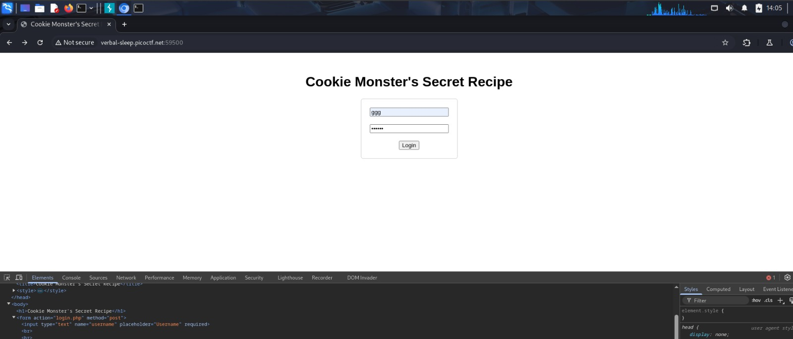
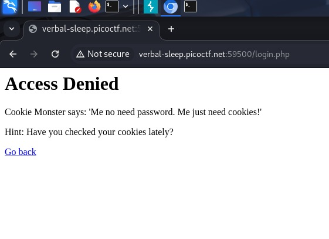
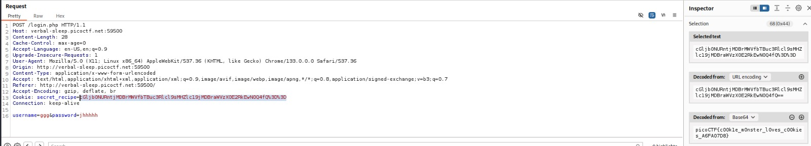

## Cookie Monster Secret Recipe
## Category
Web Exploitation

## Difficulty
Easy

## Description
Cookie Monster has hidden his top-secret
cookie recipe somewhere on his website.
As an aspiring cookie detective, your mission
is to uncover this delectable secret.
Can you outsmart Cookie Monster and find
the hidden recipe?

## My Approach

## Step 1 — First Observation
My first approach was to visit the website.
Furthermore, I used Burp Suite to
analyze the requests and responses of the site
by performing supervised attempts.

## Step 2 — What I tried
Burp Suite / Intercept → Request
used to intercept and interpret
HTTP requests and responses.
Burp Suite / Intercept → Inspector
used to decode the cookie value
found in the request.

## Step 3 — Solution
After sending my first request,
I noticed the Cookie header which
contained a secret_recipe value
in URL-encoded format. I used
Burp Suite's Inspector tab to
decode this value, which directly
revealed the flag.

## Flag
picoCTF{c00kie_m0nster_l0ves_c00kies_A6FA07D8}

## What I Learned
A website often uses cookies
to maintain an active session, which
can create vulnerabilities if sensitive
data is stored in plaintext.

Every website must apply
restrictions at the HTTP header level
to avoid any tampering attempts
that could compromise confidentiality.

Using HTTPS instead of HTTP
is essential to prevent attacks
such as Man-in-the-Middle (MITM).

This vulnerability corresponds to
OWASP A02 — Cryptographic Failures:
sensitive data stored in plaintext
in a cookie without encryption.
