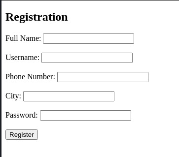
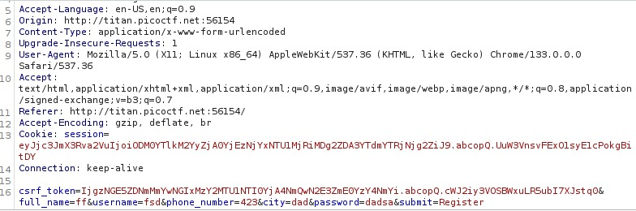
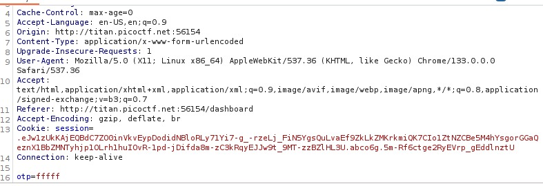
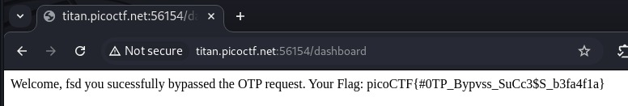

# IntroToBurp

## Category: 
Web Exploitation

## Difficulty
easy

## Description
Try here [link] to find the flag

## My approach

## step 1-First observation
Based on the title and the category i knew i was gonna use BurpSuite .started by opening there internal browser and try to seing the authentication structure.

## step 2 -What i tried
>"burpsuite" to set up proxy ,intercept and forge the otp request to bypass the authentication.
>>registration phase:

>>registration request on Burp:

>>otp request on Burp:

## step 3 -the solution
When arriving to the target app i passed the registration phase with no problems,but the otp authentication cannot be bypassed by guessing the Numbers or put illegal characters in the middle way.After multiple attempts of forging the request i arrived at the solution which is deleting the otp from the request that how the flag is found.The server only validated OTP if the field was present in the request.When the field was missing server skipped validation entirely and granted access.

## Flag
picoCTF{#0TP_Bypvss_SuCc3$S_b3fa4f1a}

## What I learned

i learned that due to bad developping we can forge requests to bypass the authentication phase either to deleting the data responsible for it or through forging cookies.
