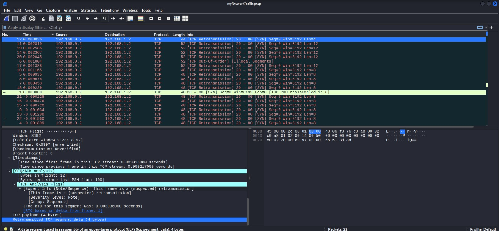
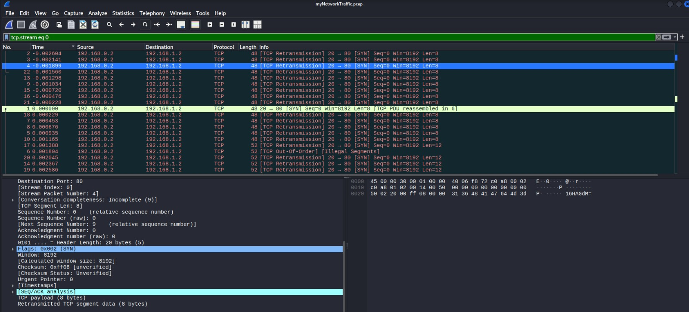
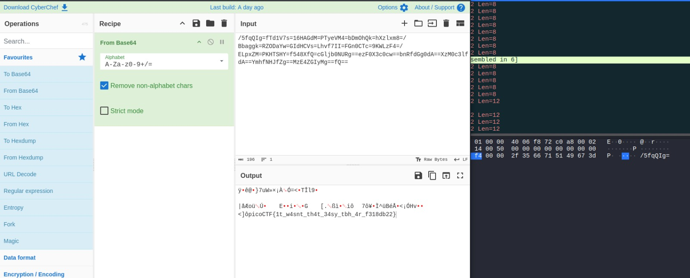
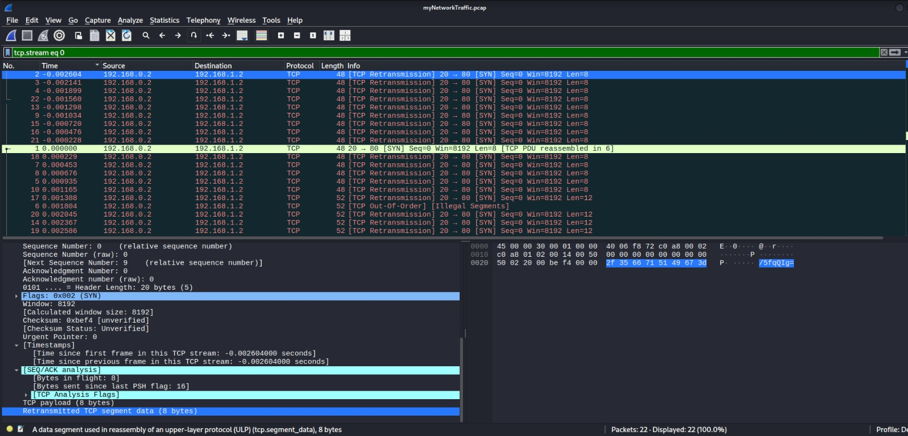

# Ph4nt0m 1ntrud3r

## Category: 
Forensics

## Difficulty
Easy

## Description
A digital ghost has breached my defenses, and my sensitive data has been stolen! 😱💻 Your mission is to uncover how this phantom intruder infiltrated my system and retrieve the hidden flag.
To solve this challenge, you'll need to analyze the provided PCAP file and track down the attack method. The attacker has cleverly concealed his moves in well timely manner. Dive into the network traffic, apply the right filters and show off your forensic prowess and unmask the digital intruder!
Find the PCAP file here [Network Traffic PCAP] file and try to get the flag.

## My approach

## step 1 - First observation

It should be noted that network traffic analysis can be done by several tools, notably Wireshark. I used the latter to analyze the given file. The traffic only contained TCP SYN packets, which was uncommon.

## step 2 - What i tried

>"filter=tcp.stream eq 0" this filter resulted in a chronological classification of the packets, however this classification can be inconsistent if the timestamp field is sabotaged by the attacker.

>"cyberchef" the attacker used a method in terms of network steganography so that the exfiltrated data is encoded and invisible to the firewall. CyberChef helped me here after an extraction operation to decode the Base64 extraction, which makes the reading of extracted data intuitive.

## step 3 - The solution

Steganography is an art of command and control, as well as exfiltration and collection. This art can be difficult to detect depending on the complexity used by the attacker. Therefore, I manually checked every field in all packets to determine the anomaly in these packets. As a result, I found two anomalies: the sequence number was always zero, which is unusual, and the TCP payload carried 8/4/16 bytes of data encoded in Base64. Furthermore, after manual assembly and decoding of these payloads, the result shows the flag surrounded by incomprehensible codes, which shows that most TCP packets were placed for the camouflage of the flag to make the analysis more difficult.

## Flag

picoCTF{it_w4snt_th4t_34sy_tbh_4r_f318db22}

## What I learned

- I learned that steganography is the best method for C2 command and control techniques or the exfiltration of small data like passwords, while avoiding detection.
- Using a simple firewall is not a secure option, however NGFW (New Generation Firewall) can fight against simple steganography methods, without forgetting to implement deep packet analysis and use algorithms to monitor SEQ Numbers to avoid the sabotage of this field...
