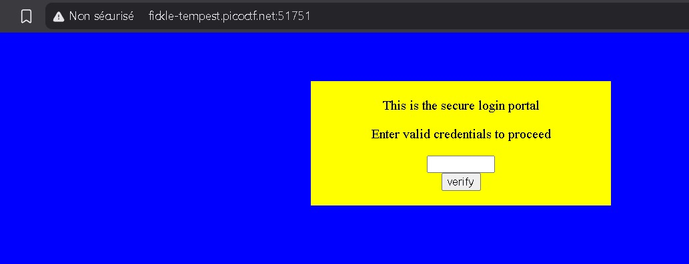
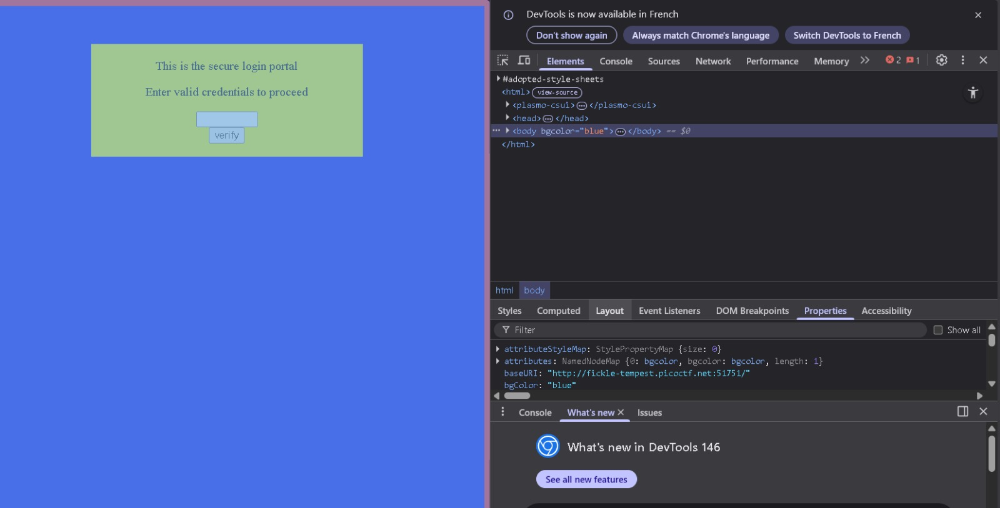
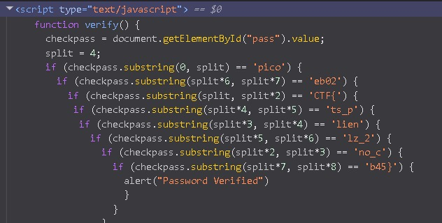

# dont-use-client-side

## Category: 
Web Exploitation

## Difficulty
Easy

## Description
Can you break into this super secure portal?
http://fickle-tempest.picoctf.net:51751[lien-temporaire]

## My approach

## step 1 - First observation
première chose j'ai utilisé le lien providé pour accéder au site .par ailleurs, j'ai commencé d'abord par l'inspection du site

## step 2 - What i tried
>"inspect section/onglet elements" utiliser pour l'analyse du code du fait que le développeur aura peut-être oublié une ou plusieurs informations sensibles capables à être utilisées pour la pénétration du site.

## step 3 - The solution

dès-lors, un code d'authentification a été détecté contenant un bloc dont son rôle est de comparer l'entré de l'utilisateur par le password en divisant les deux comparants. en terme de sécurité,laisser la vérification visible aux inspecteurs est déconseillé .

## Flag
picoCTF{no_clients_plz_2eb02b45}

## What I learned
- j'ai appris que la vérification par hashage est la meilleur méthode en raison de sécurité qui met en exergue la confidentialité des données avant la vérification en les chiffrant dans une base de données avec des fonctions de hashage qui se caractérise par l'irréversiblité sans compter que la vérification ce fait sans montrer les données sensibles.
- j'ai appris aussi à "obfuscate" les sources code pour les rendre opaques .
-certes cet information n'est pas valide sur ce ctf ,je trouve que une restriction au niveau de l'entré est crucial de sorte que l'injection par sql ou l injection de Template soient évitées
