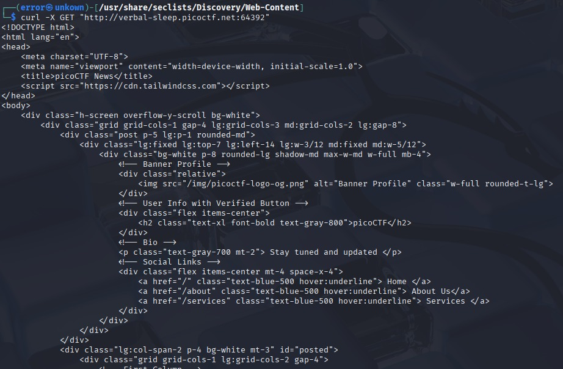
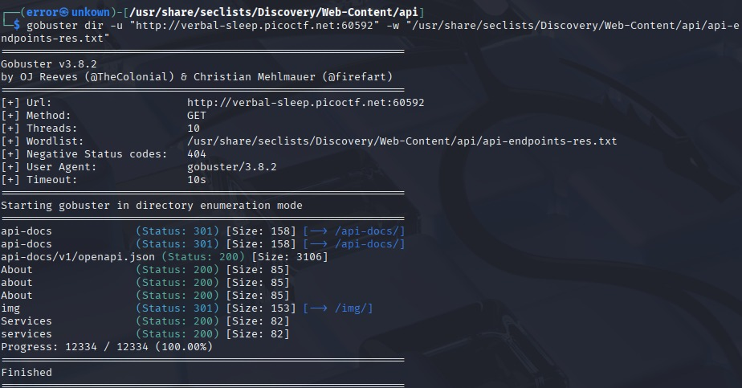
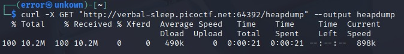
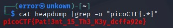

# Head-Dump

## Category
Web Exploitation

## Difficulty
Easy

## Description
Welcome to the challenge! In this challenge,
you will explore a web application and find
an endpoint that exposes a file containing
a hidden flag.
The application is a simple blog website where
you can read articles about various topics,
including an article about API Documentation.
Your goal is to explore the application and find
the endpoint that generates files holding the
server's memory, where a secret flag is hidden.

## My Approach

## Step 1 — First Observation
First, I tried to brute-force the directories
to see if there were any accessible endpoints
on this URL.

## Step 2 — What I tried

>> "curl -X GET 'URL'" to view the main page
   of the website and access the endpoints
   discovered by gobuster.

>> "gobuster dir -u 'URL' -w '/usr/share/seclists/
   Discovery/Web-Content/common.txt'" used to
   discover the different accessible endpoints.

>> "curl -X GET 'url/heapdump' --output file"
   to store the heapdump content on our local
   machine in order to search for a hidden flag.

>> "cat file | grep -o 'picoCTF{.*}'" to search
   whether the flag is present in the file.

## Step 3 — Solution
I first scanned the website to discover accessible
endpoints. One of them was /api-docs, which should
not be accessible in production. This directory is
intended for developers and contains all the API
methods and sensitive endpoints, including /heapdump
— responsible for the server memory allocation —
and that is where the flag was found.

## Flag
picoCTF{Pat!3nt_15_Th3_K3y_dcffa92e}

## What I Learned
>> Although gobuster is a great enumeration tool,
   its results can be inaccurate if the wrong
   wordlist is used.

>> On any website, before making it public,
   developers must verify the list of available
   endpoints and remove or restrict access to
   sensitive ones, as they are mostly used to
   improve performance or share sensitive
   information between developers.

>> This vulnerability corresponds to
   OWASP A05 — Security Misconfiguration :
   a debug endpoint left accessible in production.
